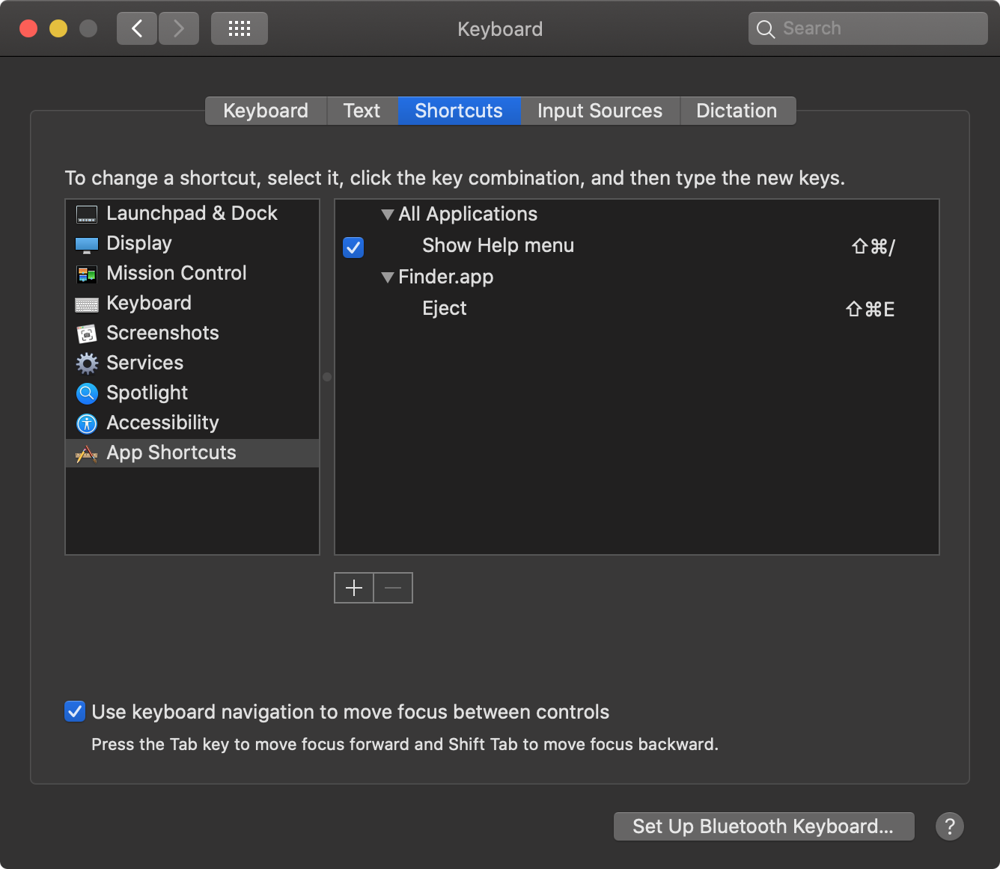

# Dotfiles

All configuration files and scripts
for setting up a new macOS or Linux machine.

Check out [phone.md](./phone.md) for setup instructions on a new phone.


## Structure

* `bin` — custom scripts
* `home` — files that are symlinked to `$HOME` directory
* `terminal` — terminal config


## Installation

1. Install XCode via the macOS App Store
1. Accept XCode license agreement
1. `cd ~ && git clone https://github.com/ad-si/dotfiles.git`
1. `cd dotfiles && ./install.sh` \
    **Attention:** The user must have sudo rights to install dependencies


## Manual Steps

Copy all relevant files from backup to new Machine.
(Check out [bin/backup](./bin/backup) for a list of all files.)


### MacOS

#### System Preferences

- General
  - Date & Time: Change date and time preferences
    - Deactivate automatic setting of time zone by location
    - Change time zone to UTC:
        `sudo ln -sf /usr/share/zoneinfo/UTC /etc/localtime`
        or
        `sudo systemsetup -settimezone GMT` (will error, but still work)
    - Display the time with seconds
    - Use a 24-hour clock
    - Show the day of the week
    - Show date

  - Language & Region
    - Preferred languages: English (US)
    - First day of the week: Monday
    - Calendar: ISO 8601
    - Temperature: Celsius
    - Advanced:
      - General:
        - Grouping: Space
        - Decimal: .
        - Measurement: Metric
      - Dates:
        - Short: y-MM-dd
        - Medium: y-MM-dd
        - Long: y-MM-dd
        - Full: y-MM-dd, D', W'w, EEEE
      - Times:
        - Short: HH:mmZZZZZ
        - Medium: HH:mm:ssZZZZZ
        - Long: HH:mm:ssZZZZZ
        - Full: HH:mm:ss.SSSZZZZZ

- Appearance
  - Light Mode (Use Nightfall to switch between light and dark mode)
  - Show scroll bars: When scrolling
  - Click in the scroll bar to: Jump to the spot that's clicked

- Control Center
  - Battery: Show Percentage
  - Keyboard Brightness: Show in Menu Bar
  - Spotlight: Don't show in menu bar

- Desktop & Dock
  - Widgets
    - Default web browser: Brave

  - Windows
    - Tiled windows have margins: Off

  - Mission Control
    - Automatically rearrange Spaces based on most recent use: Off
    - Hot Corners
      - Top Left: Put Display to Sleep Launchpad
      - Top Right: -
      - Bottom Left: Desktop
      - Bottom Right: Mission Control

- Displays:
  - Change primary display
  - Set resolution to "More Space"
  - Night Shift: Off

- Keyboard
  - Keyboard
    - Key Repeat: Fast
    - Delay Until Repeat: Short
    - Press 🌐 key to Start Dictation
    - Keyboard navigation ☑️
    - Keyboard Shortcuts
      - Launchpad & Dock
        - Turn Dock hiding on/off: Off
      - Display
        - Disable all
      - Input Sources
        - Select the previous input source: Off
      - Presenter Overlay
        - Disable all
      - Spotlight
        - Show Spotlight search "^ Space"
      - App shortcuts
          
      - Modifier Keys
        - Remap Caps Lock key to `^ Control`
  - Text Input
    - Input Sources
      - Use "ABC - Extended" keyboard layout
          to have correct direct output of "\~" and "\`"
      - Delete all other input sources
      - Disable
        - Correct spelling automatically
        - Capitalize words automatically
        - Add period with double-space
        - Use smart quotes and dashes


#### Apps

##### Calendar

- General:
  - Scroll in week view by: Week, Stop on Today
- Accounts: Add all accounts, but disable Mail for them
- Advanced:
  - Turn on time zone support
  - Show week numbers
- Enable notifications


##### Finder

- Preferences
  - Show nothing on the Desktop
  - New Finder windows show \<username\>
  - Sync Desktop & Documents folders
  - Sidebar:
      - Applications
      - Downloads
      - \<username\>
      - iCloud Drive
      - Desktop
      - Locations: All
      - Tags
  - Advanced:
    - Show all filename extensions
    - Show warning before removing from iCloud Drive
    - Show warning before emptying the Trash
    - Remove items from the Trash after 30 days
    - When performing a search: Search the Current Folder
- Sidebar:
  - Sort directories in "Favorites" section


##### iTerm

General > Settings:

- Load preferences from a custom folder or URL: `~/dotfiles/terminal`
- Save changes to folder when iTerm2 quits
- Set Fish as the default shell:
    ```sh
    echo /opt/homebrew/bin/fish | sudo tee -a /etc/shells
    chsh -s /opt/homebrew/bin/fish
    ```
    More details: https://fishshell.com/docs/current/#default-shell


##### Hammerspoon

- Deactivate all settings except:
  - Launch Hammerspoon at login
  - Show Menu Icon
- Enable Accessibility


##### Logic Pro X

- Download all additional content


#### Scripts

Jxa macOS automation scripts are symlinked from
`~/dotfiles/scripts` to `~/Library/Scripts`
and are displayed in the scripts editor submenu in the menu bar.
(Enable via
`Script Editor.app > Preferences > General > Show Script menu in menu bar`)
Add subdirectories with app names for app specific scripts.

The `symlink-dotfiles` script must be run after adding new scripts.


#### Script Libraries

Script libraries are symlinked from
`~/dotfiles/script-libraries` to `~/Library/Script Libraries/dotfiles`
and can be imported like this:

```js
const tools = Library('dotfiles/tools')
```


#### General

With descending priority:

- Set GitHub API token for Homebrew
- Install TaskLite
- Run `npm install` in the dotfiles directory
- Add Hunspell dictionaries after installation
    (e.g. https://github.com/titoBouzout/Dictionaries to
    `~/dotfiles/dictionaries`)
- Install languages for Tesseract
    (e.g. https://github.com/tesseract-ocr/tessdata_best/blob/master/deu.traineddata?raw=true)
    to `/usr/local/Cellar/tesseract/4.0.0/share/tessdata`
- Printer driver software
  - Install and setup Brother QL-810W label printer


### Git

```sh
gh auth login
```


### OpenJDK

Is installed by Homebrew,
but for the system Java wrappers to find `openjdk`, symlink it with:

```sh
sudo ln -sfn \
  /opt/homebrew/opt/openjdk/libexec/openjdk.jdk \
  /Library/Java/JavaVirtualMachines/openjdk.jdk
```


### Brave

1. Set Brave as default browser
    (Should pop up when opening Brave for the first time)
1. Go to [Brave Sync](brave://settings/braveSync/setup)
1. Join Sync Chain
1. Disable swipe history navigation:
    `defaults write com.brave.Browser AppleEnableSwipeNavigateWithScrolls -bool FALSE`
1. Set "Page zoom" to 90%

Installed extensions should then include
Midnight Lizard, Automatric Metric Conversion, …


### Firefox

- Login to Firefox Sync
- Do not print headers, footers, and margins.


### Dropbox

Sign in and enable sync for important directories.
Especially `Settings`, which is needed for Sublime Text/Merge sync.


### GPG

1. `brew install pinentry-mac`
1. Then add to gpg-agent config (skip if `.gnupg` was copied from backup):
    ```sh
    echo "pinentry-program /opt/homebrew/bin/pinentry-mac" \
      >> ~/.gnupg/gpg-agent.conf
    ```
1. `killall gpg-agent`
1. Restart shell


### Gopass

1. Make sure GPG is set up correctly.
1. Clone https://github.com/ad-si/password-store with GitHub CLI:
    `gh repo clone ad-si/password-store` and move to `~/.password-store`.
1. `gopass fsck`


### Sublime Text

- Activate installation
  - Get license key with `gopass sublimetext.com/license-key`
  - Apply under Help > Enter License
- Install Package Control
    (will then automatically install all packages from the synced list)
- Sync via Dropbox as described in https://packagecontrol.io/docs/syncing
- Set up GitHub Copilot: https://packagecontrol.io/packages/LSP-copilot#Setup
- Install additional dictionaries for spell checking:
    ```sh
    cd ~/Library/Application\ Support/Sublime\ Text/Packages/
    git clone https://github.com/titoBouzout/Dictionaries
    ```


### Sublime Merge

- Activate installation
  - Get license key from Passwords app
  - Apply under Help > Enter License
- Sync via Dropbox as described in https://packagecontrol.io/docs/syncing


### Visual Studio Code

Sign in via GitHub to sync preferences.


### Modern CSV

Open app and enter license key from Passwords app.


### Thunderbird

Follow following instructions to migrate the data folder to the new computer:
https://support.mozilla.org/en-US/kb/moving-thunderbird-data-to-a-new-computer


### Element

Log in to home server `synapse.feram.io`.


### Telegram

Log in


### WhatsApp

Log in


### Discord

Log in


### Logitech

- Log into Logitech Options account to sync mouse settings
  - Scroll direction Natural
- Logitech Options config
- Activate the Logitech Options Daemon at
    `System Preferences → Security & Privacy → Accessibility`


### Spotify

- Stream quality: Very High
- Download: Very High


### Slack

- Add all accounts


## TODO

- iterm settings
- Setup git (via `gh`?)
- Use https://github.com/Homebrew/homebrew-bundle
- Backup fish history
- Backup ngrok config
- Install Stack and HLS with ghcup
